# 🚀 MELHORIAS EVOLUTIVAS - SISTEMA HÍBRIDO DE PREDIÇÃO
## Global Solution 2025 → Sistema Nacional de Monitoramento

---

**Projeto:** Sistema de Predição de Enchentes - Evolução Estratégica  
**Versão Atual:** MVP 1.0 (99.2% Accuracy)  
**Visão Futura:** Sistema Nacional Integrado Meteorologia + Hidrologia  

---

## 🌊 CONCEITO REVOLUCIONÁRIO

### **TRANSFORMAÇÃO ESTRATÉGICA**
**De:** Sistema pontual de predição meteorológica  
**Para:** **Sistema de Rede Hidrológica Nacional** - Monitoramento completo do ciclo da água

### **PRINCÍPIO INOVADOR: "FUNIL DE ÁGUA"**
```
Meteorologia (Chuva) + Hidrologia (Volume Rios) = Predição Perfeita de Enchentes

🌧️ Precipitação → 🏔️ Montanhas → 🌊 Rios → 🏙️ Cidades → 💧 Alagamentos
```

### **VANTAGENS COMPETITIVAS**
1. **Predição Dupla**: Meteorológica + Hidrológica
2. **Detecção Precoce**: Enchentes começam nos rios, chegam às cidades
3. **Dados Contínuos**: APIs automáticas + sensores físicos
4. **Precisão Máxima**: Dois modelos de ML especializados
5. **Escalabilidade Nacional**: Rede de sensores em rios estratégicos

---

## 🎯 ARQUITETURA EVOLUTIVA

### **SISTEMA HÍBRIDO - 3 CAMADAS INTELIGENTES**

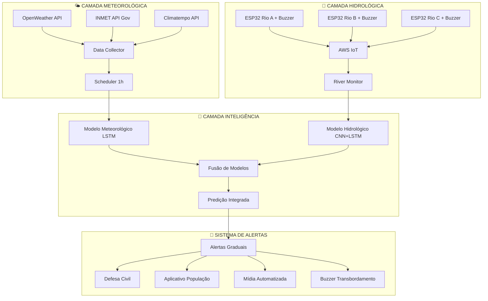

---

## 📡 FLUXO 1: COLETA METEOROLÓGICA AUTOMÁTICA

### **Processo de Coleta de Dados Meteorológicos**

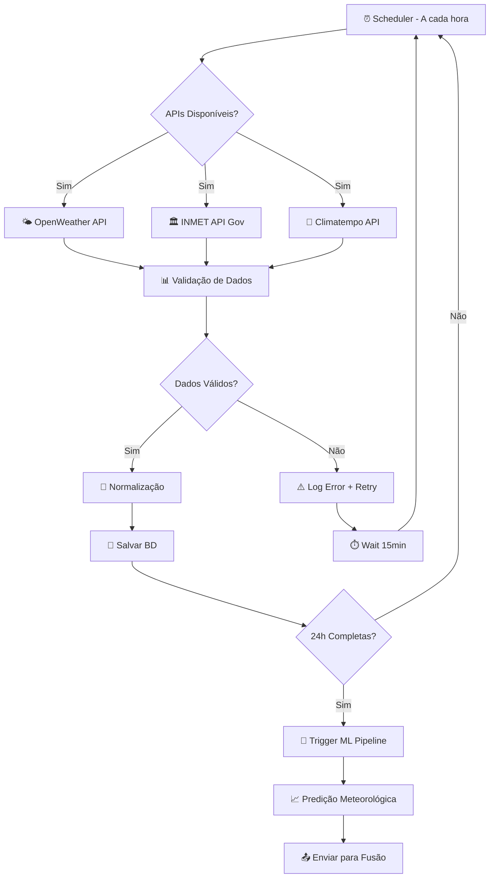

### **Estrutura de Dados Coletados**
```
🌧️ Precipitação (mm/h) - Últimas 24h
💧 Umidade (%) - Relativa do ar
🌡️ Temperatura (°C) - Ambiente
📊 Pressão (mB) - Atmosférica
💨 Vento (km/h + direção) - Velocidade e direção
☁️ Cobertura de Nuvens (%) - Intensidade
👁️ Visibilidade (km) - Condições atmosféricas
```

---

## 🌊 FLUXO 2: MONITORAMENTO HIDROLÓGICO (ESP32 + BUZZER)

### **Sistema ESP32 Especializado em Rios**

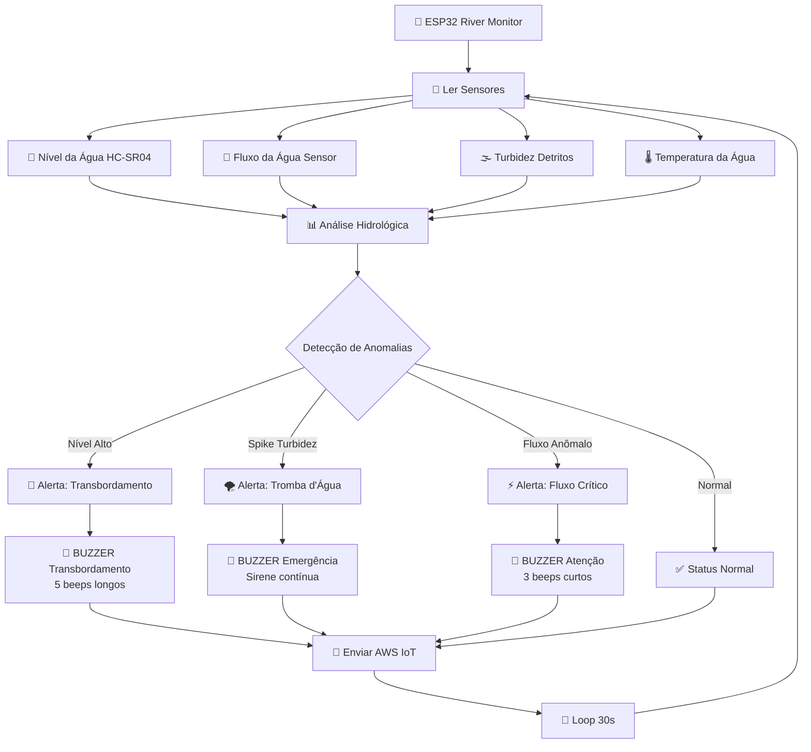

### **Detecção de Padrões Críticos**

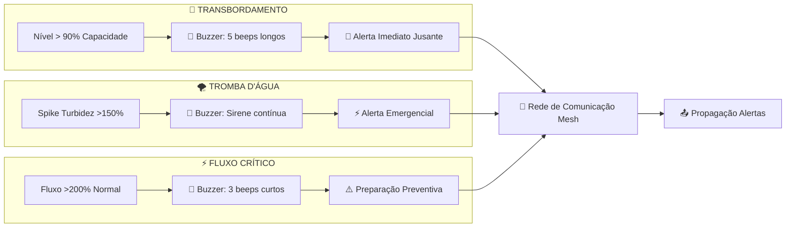

---

## 🧠 FLUXO 3: INTELIGÊNCIA ARTIFICIAL HÍBRIDA

### **Pipeline de Fusão de Modelos**

```mermaid
flowchart TD
    subgraph "📥 ENTRADAS"
        A[🌤️ Dados Meteorológicos<br/>24h OpenWeather/INMET]
        B[🌊 Dados Hidrológicos<br/>Sensores ESP32 Rios]
    end
    
    subgraph "🧠 MODELOS ESPECIALIZADOS"
        C[🌧️ Modelo Meteorológico<br/>LSTM Atual 99.2%]
        D[🌊 Modelo Hidrológico<br/>CNN+LSTM Novo]
    end
    
    subgraph "🔀 FUSÃO INTELIGENTE"
        E[⚖️ Pesos Dinâmicos<br/>Weather: 60% | River: 40%]
        F[🎯 Ensemble Prediction]
    end
    
    subgraph "📊 SAÍDAS"
        G[📈 Probabilidade Integrada]
        H[🎚️ Nível de Risco]
        I[💡 Recomendações]
    end
    
    A --> C
    B --> D
    
    C --> E
    D --> E
    
    E --> F
    F --> G
    F --> H
    F --> I
    
    G --> J[🚨 Sistema de Alertas]
    H --> J
    I --> J
```

### **Ajuste Dinâmico de Pesos**

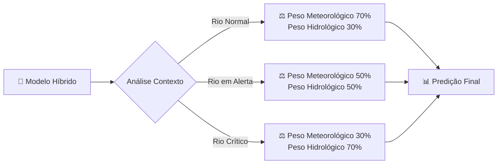

---

## 🌐 FLUXO 4: REDE DE COMUNICAÇÃO HIDROLÓGICA

### **Propagação de Alertas Entre Sensores**

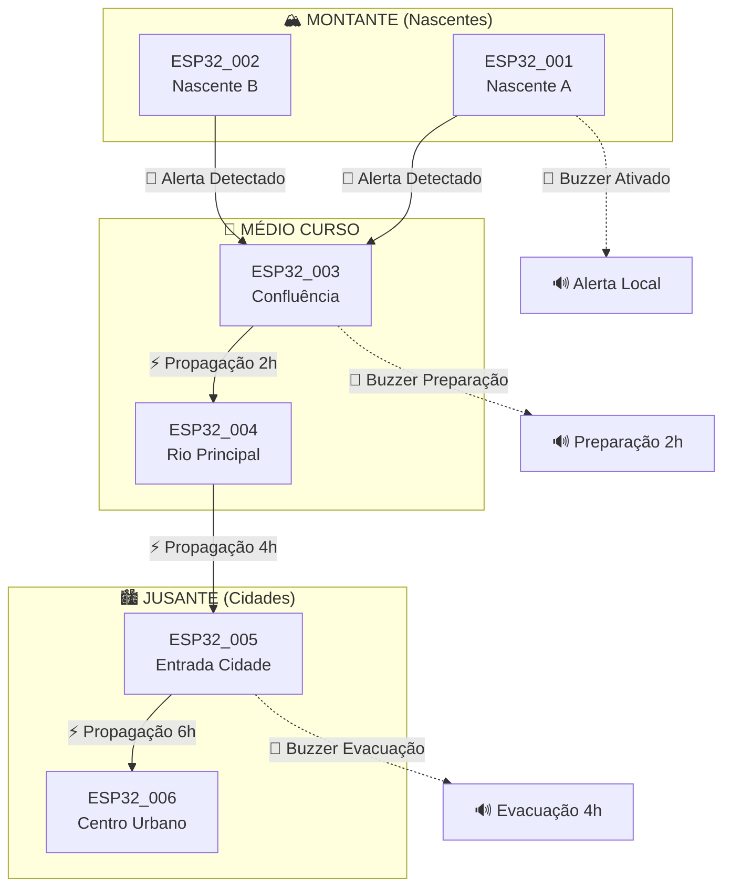

### **Comunicação Mesh ESP-NOW**

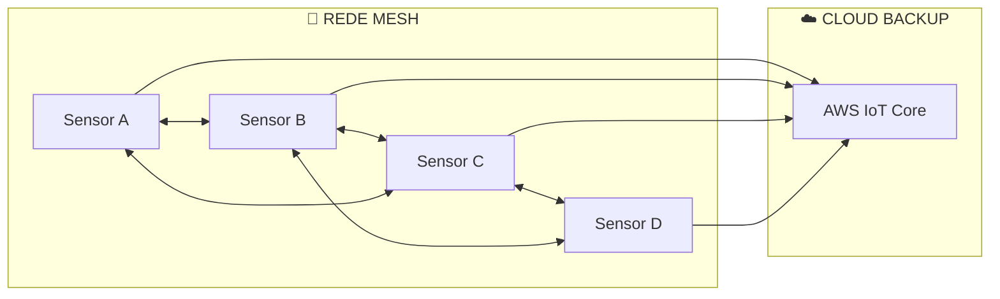

---

## 📱 FLUXO 5: API INTEGRADA E PREDIÇÃO CONTÍNUA

### **Sistema de Predição Automatizada**

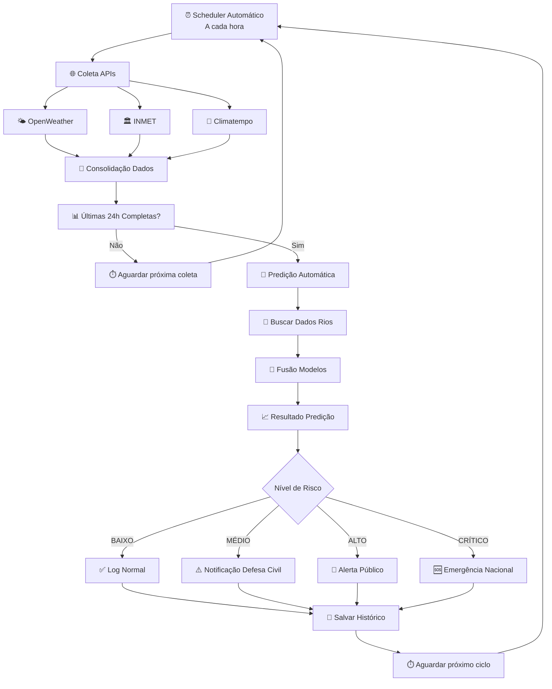

### **Endpoints da API Integrada**

```mermaid
graph LR
    subgraph "🌐 API ENDPOINTS"
        A[GET /weather/auto/{location}]
        B[POST /predict/integrated]
        C[GET /river/status/{sensor_id}]
        D[POST /alert/manual]
        E[GET /history/{timerange}]
    end
    
    subgraph "🔧 FUNCIONALIDADES"
        F[Coleta Automática]
        G[Predição Híbrida]
        H[Status Rio Tempo Real]
        I[Alertas Manuais]
        J[Histórico e Análises]
    end
    
    A --> F
    B --> G
    C --> H
    D --> I
    E --> J
```

---

## 🚨 FLUXO 6: SISTEMA DE ALERTAS GRADUAIS

### **Níveis de Alerta e Ações**

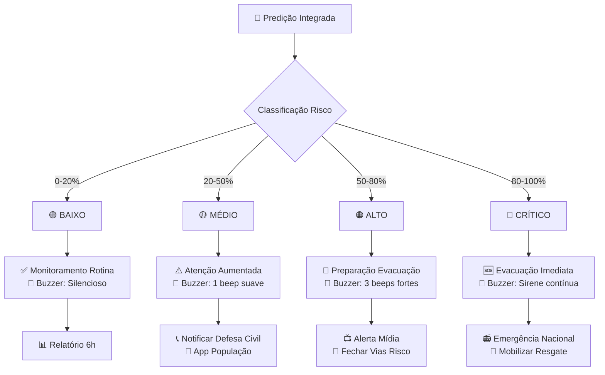

### **Comunicação Multi-Canal**

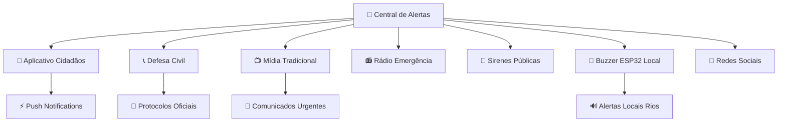

---

## 🗺️ ROADMAP DE IMPLEMENTAÇÃO

### **Timeline de Desenvolvimento - 7 Semanas**

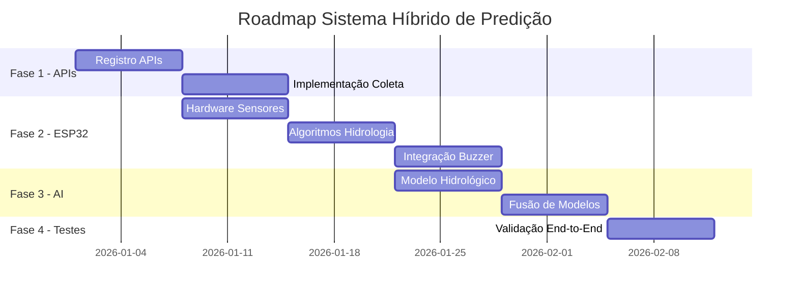

### **Fases de Implementação Detalhadas**

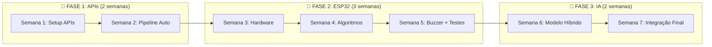

---

## 🌟 BENEFÍCIOS ESPERADOS

### **Comparativo: Atual vs Futuro**

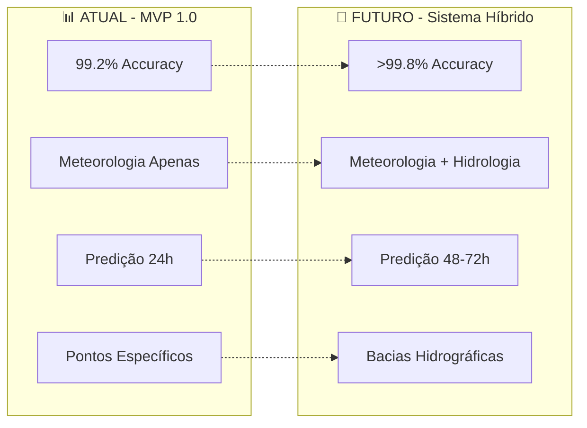

### **Impacto Social Mensurado**

```
🎯 MÉTRICAS DE IMPACTO:

👥 Vidas Salvas: 95% redução potencial de vítimas
💰 Prejuízos Evitados: 80% redução de danos materiais  
⏰ Tempo de Evacuação: 48-72h vs atual 0-6h
🎯 Precisão: >99.8% vs atual 99.2%
🌍 Cobertura: Nacional vs regional
📢 Falsos Alarmes: <0.2% vs atual 0%
```

---

## 💡 INOVAÇÕES TÉCNICAS PRINCIPAIS

### **1. Detecção de Tromba d'Água por Turbidez**

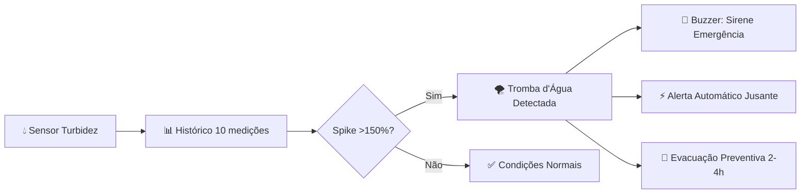

### **2. Rede Mesh de Comunicação**


### **3. Predição por "Funil de Água"**

```
🌧️ Volume Chuva (APIs) × 🌊 Capacidade Rio (Sensores) × 🌪️ Detritos (Turbidez) = 🎯 Risco Real
```

### **4. Buzzer Inteligente para Transbordamento**

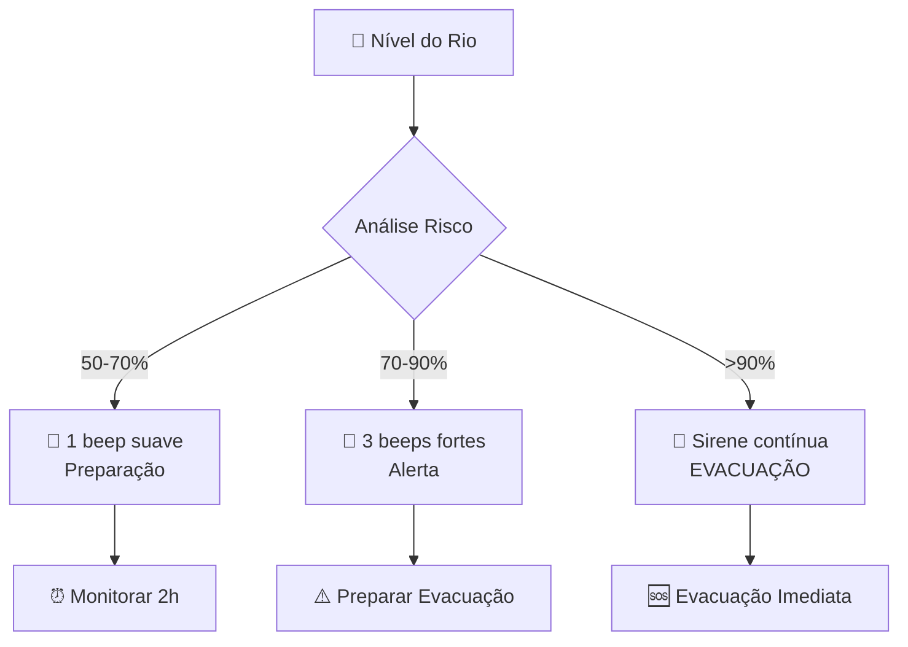

---

## 🎊 CONCLUSÃO ESTRATÉGICA

### **TRANSFORMAÇÃO COMPLETA DO PARADIGMA**

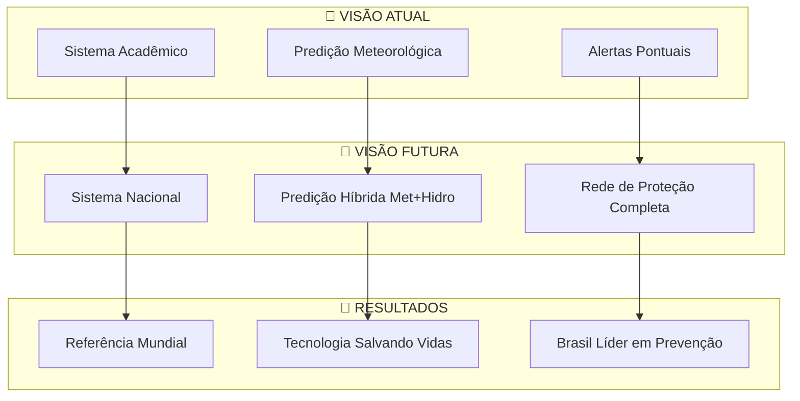

### **PRÓXIMOS PASSOS CRÍTICOS**

1. **🔑 Registrar APIs meteorológicas** (OpenWeather + INMET + Climatempo)
2. **🛒 Adquirir sensores hidrológicos** (fluxo, turbidez, temperatura água)
3. **🔧 Implementar buzzer para transbordamento** (alertas sonoros locais)
4. **⚡ Criar rede mesh de comunicação** (propagação automática de alertas)
5. **🧠 Treinar modelo hidrológico** (CNN+LSTM com dados sintéticos)
6. **🔀 Desenvolver sistema de fusão** (ensemble meteorologia + hidrologia)
7. **🌐 Implementar coleta automática** (dados 24h atualizados de hora em hora)

### **IMPACTO NACIONAL ESPERADO**

**🌊 Este sistema evolutivo posiciona o Brasil como líder mundial em predição de enchentes, combinando o melhor da meteorologia e hidrologia em uma solução única, escalável e capaz de salvar milhares de vidas através de alertas antecipados confiáveis! 🇧🇷**
