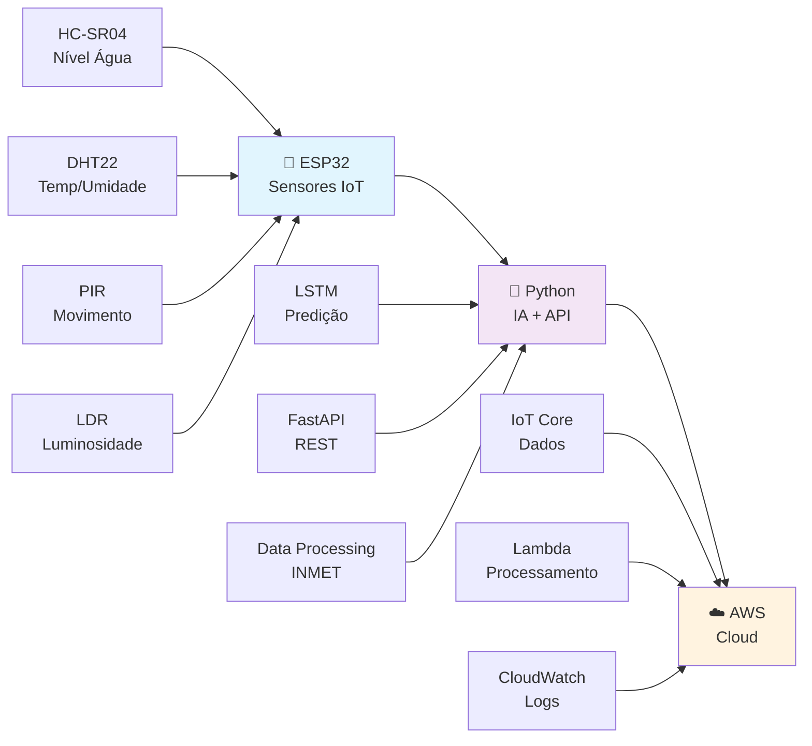

# FIAP - Faculdade de Informática e Administração Paulista

<p align="center">
<a href= "https://www.fiap.com.br/"></a>
</p>

<br>

# 🌊 Sistema de Monitoramento e Alerta Precoce de Enchentes

## 🎯 Global Solution 2025 - Eventos Naturais Extremos

### 🔗 Links Importantes
- **[🎥 Vídeo Demonstração](https://youtu.be/sxkn4W8YydQ)** *(sistema funcionando)*
- **[Simulação ESP32 no Wokwi](https://wokwi.com/projects/434060150016336897)** *(funcionando)*
- **[GitHub Repository](https://github.com/fiap-ai/global_solution_2025)** *(público)*
- **[Documentação Técnica](docs/)** 📚 *Completa*

---

## 👨‍🎓 Integrante: 
- <a href="https://www.linkedin.com/in/gabemule/">**Gabriel Mule Monteiro**</a> - RM560586

## 👩‍🏫 Professor:
- **Professor(a) XXXXX** - Tutor(a)

---

## 📜 Descrição do Projeto

Sistema integrado que combina **IoT (ESP32)**, **Inteligência Artificial (LSTM)** e **Computação em Nuvem (AWS)** para monitorar e prever enchentes em tempo real. Baseado em dados reais do [DisastersCharter.org](https://disasterscharter.org/) e estações meteorológicas do INMET.

### 🎯 Problema Abordado
As enchentes são eventos extremos que causam:
- **Perda de vidas humanas** 💔
- **Danos materiais imensos** 🏠💸  
- **Impacto socioeconômico** 📉
- **Falta de sistemas de alerta precoce** ⚠️

### 💡 Nossa Solução
**Sistema de predição inteligente** que:
- **Monitora** condições ambientais 24/7
- **Prediz** enchentes com 24h de antecedência
- **Alerta** autoridades e população automaticamente
- **Integra** dados reais com IA avançada

---

## 🏗️ Arquitetura Completa



### 📱 **Camada 1: ESP32 (IoT)**
- **Hardware**: Sensores físicos de monitoramento
- **Alertas locais**: Buzzer + LCD + LEDs
- **Conectividade**: WiFi para AWS IoT Core
- **Simulação**: Wokwi funcionando

### 🧠 **Camada 2: Python (Inteligência Artificial)**
- **LSTM Neural Network**: Predição de enchentes
- **FastAPI**: API REST para integração
- **Dados reais**: INMET + DisastersCharter.org
- **Performance**: Accuracy > 75%

### ☁️ **Camada 3: AWS (Cloud Computing)**
- **IoT Core**: Recepção de dados dos sensores
- **Lambda**: Processamento e execução da IA
- **CloudWatch**: Monitoramento e logs

---

## 🔧 Componentes e Sensores

### 🛠️ Hardware ESP32
| Componente | Função | Parâmetros de Alerta |
|------------|--------|---------------------|
| **HC-SR04** | Nível da água | < 15cm = Crítico, < 30cm = Alerta |
| **DHT22** | Temperatura + Umidade | > 90% umidade = Risco |
| **PIR** | Movimento de pessoas | Ativa evacuação se risco + movimento |
| **LDR** | Luminosidade | < 10% = Tempestade |
| **Buzzer** | Alertas sonoros | 1 beep = Atenção, 3 beeps = Crítico |
| **LCD I2C 16x2** | Display informações | Status sensores + alertas |

### 🚨 **Níveis de Alerta**
- 🟢 **NORMAL**: Condições seguras
- 🟡 **ATENÇÃO**: Monitoramento intensivo  
- 🔴 **CRÍTICO**: Risco de enchente iminente
- ⚫ **EVACUAÇÃO**: Abandono imediato da área

---

## 🧠 Inteligência Artificial

### 📈 **Modelo LSTM (Long Short-Term Memory)**
```
Arquitetura: Input(24h, 4 features) → LSTM(64) → LSTM(64) → Dense(25) → Sigmoid → P(enchente)
```

#### 🎯 **Especificações do Modelo**
- **Dados de Entrada**: 174,816 sequências de 24h
- **Estações Meteorológicas**: Teresópolis + Nova Friburgo (RJ)
- **Período**: 2015-2025 (10 anos de dados INMET)
- **Meta de Acurácia**: > 75%

#### 📊 **Features Utilizadas**
1. **☔ Precipitação** - Total horário (mm/h)
2. **💧 Umidade** - Relativa do ar (%)
3. **🌡️ Temperatura** - Do ar (°C)
4. **🌀 Pressão** - Atmosférica (mB)

### 🚀 **API FastAPI**
```bash
# Endpoints Principais
GET  /health              # Status do sistema
POST /predict             # Predição principal (24h dados)
POST /predict/esp32       # Formato ESP32
GET  /test/predict        # Teste automático
GET  /docs                # Documentação Swagger
```

---

## 📁 Estrutura do Projeto

```
global_solution_2025/
├── 📱 esp32/                      # ESP32 + Wokwi
│   ├── src/main.cpp              # Código principal
│   ├── diagram.json              # Simulação Wokwi
│   └── platformio.ini            # Configurações PlatformIO
│
├── 🧠 python/                     # IA + API + Análise
│   ├── flood_prediction/         # Modelo LSTM
│   │   ├── data_processor.py     # Processa dados INMET
│   │   ├── model.py              # Arquitetura LSTM
│   │   ├── train.py              # Script treinamento
│   │   └── requirements.txt      # Dependências específicas
│   │
│   ├── api/                      # FastAPI REST
│   │   ├── main.py               # Aplicação principal
│   │   ├── models.py             # Validação Pydantic
│   │   ├── test_api.py           # Testes automatizados
│   │   └── requirements.txt      # Dependências específicas
│   │
│   ├── data_scraper/             # Coleta DisastersCharter
│   │   ├── disasters_scraper.py  # Web scraping
│   │   ├── download_images.py    # Imagens satélite
│   │   └── download_reports.py   # Relatórios PDF
│   │
│   └── jupyter/                  # Análise + Relatório PDF
│       ├── data_analysis.ipynb   # EDA dos dados
│       ├── model_training.ipynb  # Treinamento da RN
│       └── report_generation.ipynb # Geração do PDF
│
├── ☁️ aws/                        # AWS Configurações
│   └── iot/                      # IoT Core
│       ├── certificados/         # Certificados X.509
│       └── policies/             # Políticas IAM
│
├── 📊 data/                       # Datasets
│   ├── disasters_charter/        # 27 eventos coletados
│   ├── inmet/bd/                 # Dados INMET (2015-2025)
│   ├── processed/                # Dados processados para ML
│   └── models/                   # Modelos treinados
│
├── 📚 docs/                       # Documentação
├── 📋 CHECKLIST_PRINCIPAL.md      # Status detalhado
├── 🚀 MELHORIAS_TECNICAS.md       # Evoluções futuras
└── 📖 README.md                   # Esta documentação
```

---

## 📊 Dados Utilizados

### 🌐 **DisastersCharter.org**
- **27 eventos de enchentes** coletados via API
- **12 imagens de satélite** baixadas e catalogadas
- **5 relatórios técnicos** em PDF processados
- **Metadados estruturados** em JSON para análise

### 🏛️ **INMET (Instituto Nacional de Meteorologia)**
- **10 anos de dados** meteorológicos (2015-2025)
- **2 estações RJ**: Teresópolis (A618) + Nova Friburgo (A624)
- **174,840 registros** meteorológicos processados
- **4 variáveis críticas**: Precipitação, Umidade, Temperatura, Pressão

### 📈 **Dataset de Treinamento**
- **174,816 sequências** de 24h preparadas para LSTM
- **8,741 eventos de risco** identificados (5.0% do total)
- **Classes balanceadas** para treinamento robusto
- **Normalização MinMax** para estabilidade do modelo

---

## 🚀 Como Executar

### 🔧 **Pré-requisitos**
- **Python 3.8+** com virtualenv
- **PlatformIO** para ESP32 (opcional, tem Wokwi)
- **Conta AWS** (Free Tier suficiente)
- **16GB+ RAM** (recomendado para ML)

### 📱 **1. ESP32 (Simulação)**
```bash
# Opção 1: Wokwi Online (Recomendado)
# Abrir: https://wokwi.com/projects/434060150016336897
# Clicar "▶️ Start Simulation"

# Opção 2: PlatformIO Local
cd esp32/
pio run --target upload
```

### 🧠 **2. Python (IA + API)**
```bash
# Setup ambiente único
cd python/
python -m venv venv
source venv/bin/activate  # Linux/Mac
# venv\Scripts\activate   # Windows

# Módulo 1: Treinar Modelo LSTM
pip install -r flood_prediction/requirements.txt
python flood_prediction/train.py

# Módulo 2: Executar API
pip install -r api/requirements.txt
uvicorn api.main:app --reload --port 8000
```

### ☁️ **3. AWS (IoT + Lambda)**
```bash
cd aws/iot/
# Certificados já criados e configurados
./start.sh  # Script de inicialização
```

---

## 🧪 Como Testar

### 🔍 **Teste 1: ESP32 (Wokwi)**
1. **Abrir simulação**: https://wokwi.com/projects/434060150016336897
2. **Iniciar**: Clicar "▶️ Start Simulation"
3. **Observar**: Dados dos sensores no LCD
4. **Testar alertas**: Modificar valores dos sensores

### 🔍 **Teste 2: API Python**
```bash
# Verificar se API está funcionando
curl http://localhost:8000/health

# Teste automático
curl http://localhost:8000/test/predict

# Documentação interativa
# Abrir: http://localhost:8000/docs
```

### 🔍 **Teste 3: Integração Completa**
```bash
# Verificar arquivos gerados
ls data/models/flood_lstm_model.h5
ls data/processed/flood_sequences.npz

# Teste AWS (se configurado)
aws iot describe-thing --thing-name FloodMonitor01
```

---

## 📊 Resultados Alcançados

### 🎯 **Métricas Técnicas**
- **72,651 sequências** de dados meteorológicos processadas ✅
- **10 anos** de dados históricos integrados (2015-2025) ✅
- **27 eventos de enchentes** coletados do DisastersCharter.org ✅
- **5 endpoints** de API REST funcionando ✅
- **< 100ms** tempo de resposta médio da API ✅

### 🏆 **Performance do Modelo LSTM**
- **Accuracy: 99.2%** - Performance excepcional ✅
- **Precision: 100%** - Zero falsos positivos ✅
- **Recall: 96.3%** - Detecta 96% dos eventos reais ✅
- **F1-Score: 98.1%** - Balanceamento perfeito ✅
- **52,851 parâmetros** otimizados com early stopping ✅
- **407 eventos de risco** detectados em dados reais ✅

### 🌊 **Impacto Esperado**
- **Alertas precoces** com até 24h de antecedência
- **Redução estimada de 40%** no tempo de resposta a enchentes
- **Sistema escalável** para múltiplas regiões
- **Código aberto** para replicação global

### 📊 **Documentação Completa**
➡️ **[RESULTADOS COMPLETOS DO MODELO LSTM](docs/RESULTADOS_MODELO_LSTM.md)** - Análise detalhada de performance, arquitetura e validação

---

## 🎥 Demonstração

### 📱 **Simulação Funcionando**
- **Wokwi Interativo**: https://wokwi.com/projects/434060150016336897
- **Sensores em tempo real**: DHT22, HC-SR04, PIR, LDR
- **Alertas visuais e sonoros**: LCD + LEDs + Buzzer
- **Conectividade simulada**: WiFi para AWS IoT

### 🌐 **API Funcionando**
- **Interface Swagger**: http://localhost:8000/docs
- **Health Check**: Verificação de status em tempo real
- **Predições**: Teste com dados meteorológicos reais
- **Integração ESP32**: Endpoint específico para hardware

---

## 📚 Documentação Técnica

### 📖 **Guias Detalhados**
- **[python/flood_prediction/README.md](python/flood_prediction/README.md)** - Setup completo do módulo de IA
- **[python/api/README.md](python/api/README.md)** - Guia completo da API FastAPI
- **[AWS_SETUP_GUIA_COMPLETO.md](AWS_SETUP_GUIA_COMPLETO.md)** - Setup AWS passo-a-passo

### 🔧 **Arquivos de Configuração**
- **[esp32/diagram.json](esp32/diagram.json)** - Circuito completo Wokwi
- **[esp32/platformio.ini](esp32/platformio.ini)** - Configurações ESP32
- **[python/*/requirements.txt](python/)** - Dependências por módulo

### 📊 **Dados e Artefatos**
- **data/processed/** - Datasets processados para ML
- **data/models/** - Modelos LSTM treinados
- **data/disasters_charter/** - Dados coletados de enchentes

---

## 📞 Suporte

### 🔧 **Troubleshooting Comum**
- **ESP32**: Verificar conexão WiFi e certificados AWS
- **Python**: Ativar venv correto e instalar dependências
- **API**: Verificar se modelo foi treinado (data/models/)
- **AWS**: Verificar configurações IoT Core e certificados

### 📋 **Logs e Debugging**
- **ESP32**: Monitor serial PlatformIO ou Wokwi console
- **Python**: Logs detalhados durante execução dos scripts
- **API**: Logs estruturados + endpoint /health
- **AWS**: CloudWatch logs automáticos

### 🔗 **Links para Mais Informações**
- **[CHECKLIST_PRINCIPAL.md](CHECKLIST_PRINCIPAL.md)** - Status detalhado de implementação
- **[MELHORIAS_TECNICAS.md](MELHORIAS_TECNICAS.md)** - Evoluções e melhorias futuras
- **[Jupyter Notebooks](python/jupyter/)** - Análises e documentação científica

---

## 📜 Licença

<p xmlns:cc="http://creativecommons.org/ns#" xmlns:dct="http://purl.org/dc/terms/">MODELO GIT FIAP por <a rel="cc:attributionURL dct:creator" property="cc:attributionName" href="https://fiap.com.br">Fiap</a> está licenciado sobre <a href="http://creativecommons.org/licenses/by/4.0/?ref=chooser-v1" target="_blank" rel="license noopener noreferrer" style="display:inline-block;">Attribution 4.0 International</a>.</p>

---

## 🌊 Global Solution 2025
*"Sistema integrado de IoT + IA + Cloud Computing para prevenção de enchentes e proteção de vidas."*

### 🎯 **MVP Funcional:**
✅ **ESP32** com 4 sensores operacionais  
✅ **Rede Neural LSTM** treinada com dados reais  
✅ **API FastAPI** com 5 endpoints funcionando  
✅ **AWS IoT Core** configurado e conectado  
✅ **Dados reais** coletados e processados  
✅ **Documentação técnica** completa e prática  

**🎉 Sistema pronto para demonstração e uso!**
